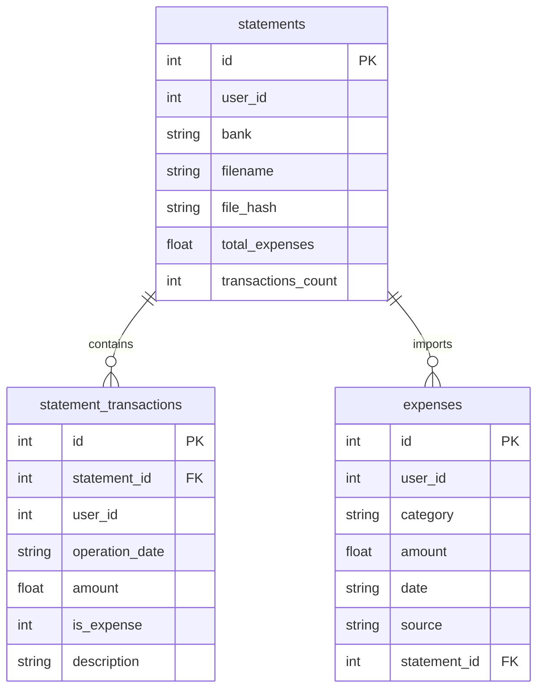

# Архитектура финансового Telegram-бота

## Обзор

Бот — персональный финансовый помощник для учёта расходов в тенге (KZT). Построен на **aiogram 3.x**, хранит данные в **SQLite** (aiosqlite), асинхронно обрабатывает сообщения Telegram.

```
Telegram → main.py → Dispatcher → handlers/ → database.py / services/
```

## Структура проекта

| Путь | Назначение |
|------|------------|
| `main.py` | Точка входа: Bot, Dispatcher, polling |
| `bot/config.py` | `.env`, константы, логирование |
| `bot/database.py` | CRUD: расходы, выписки, статистика |
| `bot/keyboards.py` | Инлайн-клавиатуры |
| `bot/states.py` | FSM-состояния (ввод суммы, загрузка файла) |
| `bot/handlers/` | Обработчики команд и callback-кнопок |
| `bot/services/currency.py` | API курсов валют |
| `bot/services/statements/` | Парсеры банковских выписок |
| `tests/` | Unit- и интеграционные тесты |
| `data/finance.db` | SQLite (создаётся автоматически) |

## Потоки данных

### 1. Ручной расход

```
Кнопка «Добавить расход»
  → выбор категории (callback cat:*)
  → FSM ExpenseStates.waiting_for_amount
  → валидация суммы (handlers/expenses.py)
  → database.add_expense()
  → таблица expenses
```

### 2. Загрузка выписки

```
Кнопка «Загрузить выписку»
  → выбор банка (callback bank:*)
  → FSM StatementStates.waiting_for_file
  → пользователь отправляет документ
  → services/statements/parser.parse_statement()
  → database.save_statement()
      ├── statements          (метаданные файла)
      ├── statement_transactions (все операции)
      └── expenses (только расходы, source='statement')
```

### 3. Удаление выписки

```
«Мои выписки» → кнопка 🗑 → подтверждение
  → database.delete_statement()
      ├── DELETE expenses WHERE statement_id = ?
      ├── DELETE statement_transactions
      └── DELETE statements
```

Ручные расходы (`source='manual'`) не затрагиваются.

### 4. Статистика

`get_monthly_stats()` агрегирует таблицу `expenses` за текущий месяц (`date LIKE 'YYYY-MM%'`).

## Схема базы данных



## Парсинг выписок

Единая точка входа: `services/statements/parser.py` → `parse_statement()`.

| Формат | Модуль | Особенности |
|--------|--------|-------------|
| PDF | `parsers/pdf_converter.py` | Таблицы pdfplumber + текст + layout |
| Excel | `parsers/spreadsheet.py` | Все листы, эвристики Kaspi |
| CSV | `parsers/spreadsheet.py` | Автоопределение разделителя |
| 1C (.txt) | `parsers/onec.py` | Секции `СекцияДокумент` |

**Kaspi Gold PDF:** `pdf_converter` извлекает таблицы со всех страниц, `kaspi.py` отфильтровывает баланс, курсы USD/EUR и собирает операции по дате + сумме в любой ячейке.

**Автокатегоризация:** `categorizer.py` сопоставляет описание (Magnum → Продукты, Yandex Go → Транспорт).

## Обработчики (handlers)

| Файл | Ответственность |
|------|-----------------|
| `start.py` | `/start`, `/menu`, главное меню |
| `expenses.py` | Добавление расхода, FSM суммы |
| `statements.py` | Загрузка, список, удаление выписок |
| `stats.py` | «Мои расходы» за месяц |
| `currency.py` | Курс USD/EUR/RUB |

Роутеры собираются в `handlers/__init__.py` → `setup_routers()`.

## Конфигурация

`bot/config.py` загружает `BOT_TOKEN` из `.env`. Без токена приложение не стартует.

## Тестирование

```bash
pip install -r requirements-dev.txt
pytest tests/ -v
```

| Файл тестов | Что проверяет |
|-------------|---------------|
| `test_utils.py` | Парсинг дат и сумм |
| `test_kaspi.py` | Kaspi PDF/Excel эвристики |
| `test_categorizer.py` | Автокатегории |
| `test_onec.py` | Формат 1C |
| `test_database.py` | Сохранение, удаление, статистика |
| `test_parser.py` | Определение типа файла, CSV |

Фикстура `test_db` в `conftest.py` подменяет путь к БД на временный файл.

## Зависимости между слоями

```
handlers  →  database, keyboards, services, states
database  →  config, categorizer, models
services  →  config, parsers (без handlers!)
main      →  config, database, handlers
```

Handlers не импортируют друг друга — только общие модули. Это упрощает тестирование парсеров и БД отдельно от Telegram.

## Расширение

- Новый банк: добавить в `SUPPORTED_BANKS`, при необходимости — парсер в `parsers/`
- Новая категория: `MANUAL_EXPENSE_CATEGORIES` + ключевые слова в `categorizer.py`
- Новая команда: router в `handlers/`, регистрация в `setup_routers()`
